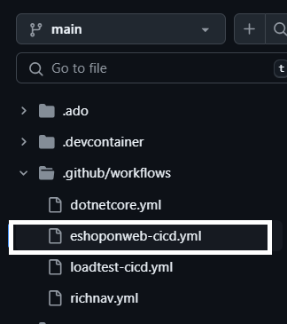

---
lab:
  title: 'Laboratório 02: Use o GitHub Actions para Azure para publicar um aplicativo Web no Serviço de Aplicativo do Azure'
  module: 'Module 2: Implement GitHub Actions for Azure'
---

# Visão geral

Neste laboratório, você aprenderá a implementar um fluxo de trabalho de Ação do GitHub que implanta um aplicativo Web ao Serviço de Aplicativo do Azure.

Após concluir este laboratório, você poderá:

* Implementar um fluxo de trabalho do GitHub Actions para CI/CD.
* Explicar as características básicas dos fluxos de trabalho do GitHub Action.

**Tempo estimado de conclusão: 40 minutos**

## Pré-requisitos

* Uma **conta do Azure** com uma assinatura ativa. Caso ainda não tenha uma, inscreva-se em uma avaliação gratuita em [https://azure.com/free](https://azure.com/free).
    * Um [navegador](https://learn.microsoft.com/azure/azure-portal/azure-portal-supported-browsers-devices) compatível com o portal da Web do Azure.
    * Uma conta Microsoft ou uma conta do Microsoft Entra com função de Proprietário ou Colaborador na assinatura do Azure. Para obter detalhes, veja [Listar designações de função do Azure usando o portal do Azure](https://docs.microsoft.com/azure/role-based-access-control/role-assignments-list-portal) e [Exibir e designar funções de administrador no Azure Active Directory](https://docs.microsoft.com/azure/active-directory/roles/manage-roles-portal).
* Uma conta do GitHub. Se você ainda não tem uma conta do GitHub que possa usar para este laboratório, siga as instruções disponíveis em [Como se inscrever em uma nova conta do GitHub](https://github.com/join) para criar uma.

## Instruções

## Exercício 1: Importar o eShopOnWeb para o repositório GitHub

Neste exercício, você importará o repositório [eShopOnWeb](https://github.com/MicrosoftLearning/eShopOnWeb) para sua conta do GitHub. O repositório está organizado da seguinte forma:

| Pasta | Sumário |
| -- | -- |
| **.ado** | Pipelines YAML do Azure DevOps |
| **.devcontainer** | Configuração para o desenvolvimento usando contêineres (localmente no VS Code ou no GitHub Codespaces) |
| **infra** | Infraestrutura Bicep e ARM como modelos de código usados em alguns cenários de laboratório |
| **.github** | Definições de fluxo de trabalho do GitHub YAML |
| **src** | O site .NET 8 usado em cenários de laboratório |

### Tarefa 1: Importar o repositório eShopOnWeb

1. No navegador da Web, navegue até o Github [http://github.com](http://github.com) e entre usando sua conta.
1. Inicie o processo de importação [https://github.com/new/import](https://github.com/new/import).
1. Insira as informações a seguir na página **Importar seu projeto para o GitHub**.

    | Configuração | Ação |
    |--|--|
    | **A URL do repositório fonte** | Inserir `https://github.com/MicrosoftLearning/eShopOnWeb` |
    | **Proprietário** | Selecione seu alias do GitHub |
    | **Nome do repositório** | Entre no **eShopOnWeb** |
    | **Privacidade** | Depois de selecionar o **Proprietário**, as opções de privacidade aparecerão. Selecione **Público**. |

1. Selecione **Iniciar importação** e aguarde a conclusão do processo de importação.
1. Na página do repositório, selecione **Configurações** e, em seguida, selecione **Ações > Geral** no painel de navegação esquerdo.
1. Na seção **Permissões de ações** da página, selecione a opçào **Permitir todas as ações e fluxos de trabalho reutilizáveis** e, em seguida, selecione **Salvar**.

> **OBSERVAÇÃO:** o eShopOnWeb é um repositório grande e pode levar de 5 a 10 minutos para concluir a importação.

## Exercício 2: Criar recursos do Azure e configurar o GitHub 

Neste exercício, você criará uma entidade de serviço do Azure para autorizar o acesso do GitHub à sua assinatura do Azure a partir do GitHub Actions. Você também revisará e modificará o fluxo de trabalho do GitHub que compilará, testará e implantará seu site no Azure.

### Tarefa 1: criar uma entidade de serviço do Azure e salvá-la como segredo do GitHub

Nesta tarefa, você criará um grupo de recursos e uma entidade de serviço do Azure. A entidade de serviço é usada pelo GitHub para implantar o aplicativo eShopOnWeb desejado.

1. Em seu navegador, navegue até o portal do Azure [https://portal.azure.com](https://portal.azure.com).
1. Abra o **Cloud Shell** e selecione o modo **Bash**. **Observação:** se esta é a primeira vez que você abre o Cloud Shell, você precisará configurar o armazenamento persistente.
1. Crie um grupo de recursos com o comando da CLI `az group create`. Substitua `<location>` por uma região perto de você.

    ```
    az group create -n az2006-rg -l <location>
    ```

1. Execute o seguinte comando para registrar o provedor de recursos para o **Serviço de Aplicativo do Azure** que você implantará posteriormente:

    ```bash
    az provider register --namespace Microsoft.Web
    ```

1. Execute o comando a seguir para gerar um nome aleatório para o aplicativo Web implantado no Serviço de Aplicativo do Azure. Copie e salve o nome que o comando gera para uso posterior nesse laboratório.

    ```
    myAppName=az2006app$RANDOM
    echo $myAppName
    ```

1. Execute os comandos a seguir para recuperar sua ID da assinatura. Certifique-se de copiar e salvar a saída dos comandos, o valor da ID da assinatura será usado posteriormente neste laboratório.

    ```
    subId=$(az account list --query "[?isDefault].id" --output tsv)
    
    echo $subId
    ```

1. Crie uma entidade de serviço com os seguintes comandos. O primeiro comando armazena a ID do grupo de recursos em uma variável.

    ```
    rgId=$(az group show -n az2006-rg --query "id" -o tsv)

    az ad sp create-for-rbac --name GH-Action-eshoponweb --role contributor --scopes $rgId
    ```

    >**IMPORTANTE:** este comando gera um objeto JSON que contém os identificadores usados para autenticar no Azure em nome de uma identidade do Microsoft Entra (entidade de serviço). Copie o objeto JSON para usá-lo nas etapas a seguir. 

1. Em uma janela do navegador, navegue até seu repositório GitHub **eShopOnWeb**.
1. Na página do repositório, selecione **Configurações** e no painel de navegação esquerdo, selecione **Segredos e variáveis > Ações**.
1. Selecione **Novo segredo do repositório** e insira as seguintes informações:
    * **NOME**: `AZURE_CREDENTIALS`
    * **Segredo**: insira o objeto JSON gerado ao criar a entidade de serviço.
1. Selecione **Adicionar segredo**.

### Tarefa 2: modificar e executar o fluxo de trabalho do GitHub

Nesta tarefa, você modificará o fluxo de trabalho do GitHub *eshoponweb-cicd.yml* fornecido e o executará para implantar a solução em sua própria assinatura.

1. Em uma janela do navegador, volte para o repositório do GitHub **eShopOnWeb**.
1. Selecione **<> Code** e, na ramificação principal, selecione **eshoponweb-cicd.yml** na pasta **eShopOnWeb/.github/workflows**. Esse fluxo de trabalho define o processo de CI/CD para o aplicativo eShopOnWeb.

    
1. Selecione **Editar este arquivo**.
1. Altere os campos na seção `env:` do arquivo para os seguintes valores.

    | Campo | Ação |
    |--|--|
    | RESOURCE-GROUP: | `az2006-rg` |
    | LOCATION: | `eastus` (Ou a região selecionada ao criar o grupo de recursos.) |
    | TEMPLATE-FILE: | Sem alterações |
    | SUBSCRIPTION-ID: | Sua ID da assinatura. |
    | WEBAPP-NAME: | O nome do aplicativo wep gerado aleatoriamente que você criou anteriormente no laboratório. |

1. Leia o fluxo de trabalho com atenção. Comentários são fornecidos para ajudar a entender as etapas no fluxo de trabalho.
1. Remova o comentário da seção **on** na parte superior do arquivo ao excluir `#`. O fluxo de trabalho é acionado a cada push para a ramificação principal e também oferece acionamento manual (`workflow_dispatch`).
1. Selecione **Confirmar alterações...** na parte superior direita da página.
1. Uma janela pop-up será exibida. Aceite os padrões (fazer commit diretamente com a ramificação principal) e selecione **Confirmar alterações**. O fluxo de trabalho será executado automaticamente.

### Tarefa 3: Revisar a execução do fluxo de trabalho do GitHub

Nesta tarefa, você analisará a execução do fluxo de trabalho do GitHub e visualizará o aplicativo em execução.

1.Selecione **Ações** e você verá a configuração do fluxo de trabalho antes de executar.

1. Selecione o trabalho **eShopOnWeb Build and Test** na seção **Todos os fluxos de trabalho** da página. 

1. O fluxo de trabalho é composto por duas operações: **buildandtest** e **deploy**. Você pode selecionar qualquer operação e exibir seu progresso ou aguardar até que o trabalho seja concluído.

1. Navegue até o portal do Azure [https://portal.azure.com](https://portal.azure.com) e navegue até o grupo de recursos **az2006-rg** criado anteriormente. Observe que o GitHub Actions, usando um modelo Bicep, criou um Plano do Serviço de Aplicativo do Azure + Serviço de Aplicativo no grupo de recursos. 

1. Selecione o recurso Serviço de Aplicativo (o nome exclusivo do aplicativo gerado anteriormente) e, em seguida, selecione **Procurar** próximo à parte superior da página para exibir o aplicativo Web implantado.

## Exercício 3: Limpar recursos

Neste exercício, você excluirá os recursos criados anteriormente no laboratório.

1. Navegue até o portal do Azure [https://portal.azure.com](https://portal.azure.com) e inicie o Cloud Shell. Selecione a sessão do shell do **Bash**.

1. Execute o comando a seguir para excluir o grupo de recursos `az2006-rg`. Ele também removerá o Plano do Serviço de Aplicativo e a instância do Serviço de Aplicativo.

    ```
    az group delete -n az2006-rg --no-wait --yes
    ```

    >**Observação**: o comando é executado de modo assíncrono (conforme determinado pelo parâmetro `--no-wait`), portanto, embora você possa executar outro comando da CLI do Azure imediatamente depois na mesma sessão do Bash, levará alguns minutos antes de os grupos de recursos serem removidos.

## Revisão

Neste laboratório, você implementou um fluxo de trabalho do GitHub Actions que implanta um aplicativo Web do Azure.
