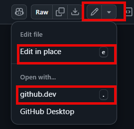

---
lab:
  title: 'Laboratório 03: Automatizar o Teste de Carga do Azure usando o GitHub Actions '
  module: 'Module 3: Implement Azure Load Testing'
---

# Visão geral

Neste laboratório, você aprenderá a configurar o GitHub Actions para implantar um aplicativo Web de exemplo e iniciar um teste de carga usando o Teste de Carga do Azure.

Neste laboratório, você vai:

* Crie recursos do Serviço de Aplicativo e do Teste de Carga no Azure.
* Crie e configure uma entidade de serviço para habilitar fluxos de trabalho do GitHub Actions para executar ações em sua conta do Azure.
* Implante um aplicativo .NET 8 no Serviço de Aplicativo do Azure usando um fluxo de trabalho do GitHub Actions.
* Atualize um fluxo de trabalho do GitHub Actions para invocar um teste de carga baseado em URL.

**Tempo estimado de conclusão: 40 minutos**

## Pré-requisitos

* Uma **conta do Azure** com uma assinatura ativa. Caso ainda não tenha uma, inscreva-se em uma avaliação gratuita em [https://azure.com/free](https://azure.com/free).
    * Um [navegador](https://learn.microsoft.com/azure/azure-portal/azure-portal-supported-browsers-devices) compatível com o portal da Web do Azure.
    * Uma conta Microsoft ou uma conta do Microsoft Entra com função de Proprietário ou Colaborador na assinatura do Azure. Para obter detalhes, veja [Listar designações de função do Azure usando o portal do Azure](https://docs.microsoft.com/azure/role-based-access-control/role-assignments-list-portal) e [Exibir e designar funções de administrador no Azure Active Directory](https://docs.microsoft.com/azure/active-directory/roles/manage-roles-portal).
* Uma conta do GitHub. Se você ainda não tem uma conta do GitHub que possa usar para este laboratório, siga as instruções disponíveis em [Como se inscrever em uma nova conta do GitHub](https://github.com/join) para criar uma.


## Instruções

## Exercício 1: Importar o aplicativo de amostra para o repositório GitHub

Neste exercício, você importará o repositório do [aplicativo de amostra de teste de carga do Azure](https://github.com/MicrosoftLearning/azure-load-test-sample-app) para sua própria conta do GitHub.

### Tarefa 1: Importar o repositório eShopOnWeb

1. No navegador da Web, navegue até o Github [http://github.com](http://github.com) e entre usando sua conta.
1. Inicie o processo de importação [https://github.com/new/import](https://github.com/new/import).
1. Insira as informações a seguir na página **Importar seu projeto para o GitHub**.

    | Configuração | Ação |
    |--|--|
    | **A URL do repositório fonte** | Inserir `https://github.com/MicrosoftLearning/azure-load-test-sample-app` |
    | **Proprietário** | Selecione seu alias do GitHub |
    | **Nome do repositório** | Nomeie seu repositório |
    | **Privacidade** | Depois de selecionar o **Proprietário**, as opções de privacidade aparecerão. Selecione **Público**. |

1. Selecione **Iniciar importação** e aguarde a conclusão do processo de importação.
1. Na página do novo repositório, selecione **Configurações** e, em seguida, selecione **Ações > Geral** no painel de navegação esquerdo.
1. Na seção **Permissões de ações** da página, selecione a opçào **Permitir todas as ações e fluxos de trabalho reutilizáveis** e, em seguida, selecione **Salvar**.

## Exercício 2: Criar recursos no Azure

Neste exercício, você criará os recursos no Azure necessários para implantar o aplicativo e executar o teste. 

### Tarefa 1: Criar recursos usando a CLI do Azure.

Nessa tarefa, você criará os seguintes recursos do Azure:

* Grupo de recursos
* Plano do Serviço de Aplicativo
* Instância do Serviço de Aplicativo
* Instância do Teste de carga

1. Em seu navegador, navegue até o portal do Azure [https://portal.azure.com](https://portal.azure.com).
1. Abra o **Cloud Shell** e selecione o modo **Bash**. **Observação:** você pode precisa configurar o armazenamento persistente se esta for a primeira vez que inicializar o Cloud Shell.

1. Execute os comandos a seguir, um de cada vez, para criar variáveis usadas nos comandos no restante das etapas. Substitua `<mylocation>` pelo local de sua preferência.

    ```
    myLocation=<mylocation>
    myAppName=az2006app$RANDOM
    ```
1. Execute os comandos a seguir para criar o grupo de recursos para conter todos os recursos.

    ```
    az group create -n az2006-rg -l $myLocation
    ```

1. Execute o seguinte comando para registrar o provedor de recursos para o **Serviço de Aplicativo do Azure**.

    ```bash
    az provider register --namespace Microsoft.Web
    ```

1. Execute os comandos a seguir para criar o Plano do Serviço de Aplicativo. **Observação:** o plano B1 usado no Plano do Serviço de Aplicativo pode incorrer em custos. 

    ```
    az appservice plan create -g az2006-rg -n az2006webapp-plan --sku B1
    ```

1. Execute o comando a seguir para criar a instância do Serviço de Aplicativo para o aplicativo.

    ```
    az webapp create -g az2006-rg -p az2006webapp-plan -n $myAppName --runtime "dotnet:8"
    ```

1. Execute o comando a seguir para criar um recurso de teste de carga. Se você receber uma solicitação para instalar a extensão de **carga**, escolha sim.

    ```
    az load create -n az2006loadtest -g az2006-rg --location $myLocation
    ```

1. Execute os comandos a seguir para recuperar sua ID da assinatura. **Observação:** certifique-se de copiar e salvar a saída dos comandos, o valor da ID da assinatura será usado posteriormente neste laboratório.

    ```
    subId=$(az account list --query "[?isDefault].id" --output tsv)
    
    echo $subId
    ```

### Tarefa 2: Criar a entidade de serviço e configurar a autorização

Nesta tarefa, você criará uma entidade de serviço para o aplicativo e a configurará para autenticação federada do OpenID Connect.

1. No portal do Azure, pesquise **Microsoft Entra ID** e navegue até o serviço.

1. No painel de navegação esquerdo, selecione **Registros de aplicativo** no grupo **Gerenciar**. 

1. Selecione **+ Novo registro** no painel principal, insira `GH-Action-webapp` como o nome e selecione **Registrar**.

    >**IMPORTANTE:** copie e salve os valores de **ID do aplicativo (cliente)** e **ID do diretório (locatário)** para mais tarde neste laboratório.


1. No painel de navegação esquerdo, selecione **Certificados e segredos** no grupo **Gerenciar** e, na janela principal, selecione **Credenciais federadas**. 

1. Selecione **Adicionar uma credencial** e selecione **GitHub Actions implantando recursos do Azure** na lista suspensa de seleção.

1. Insira as seguintes informações na seção **Conectar sua conta do GitHub**. **Observação:** Estes campos diferenciam maiúsculas de minúsculas. 

    | Campo | Ação |
    |--|--|
    | Organização | Insira o nome do usuário ou da organização. |
    | Repositório | Insira o nome do repositório que você criou anteriormente no laboratório. |
    | Tipo de entidade | Selecione a **ramificação**. |
    | Nome do branch do GitHub | Digite **main**. |

1. Na seção **Detalhes da credencial**, dê um nome à sua credencial e selecione **Adicionar**.

### Tarefa 3: Atribuir funções à entidade de serviço

Nesta tarefa, você atribuirá as funções necessárias à entidade de serviço para acessar seus recursos.

1. Execute os comandos a seguir para atribuir a função "Colaborador de Teste de Carga" para que o fluxo de trabalho do GitHub possa enviar os testes de recursos para execução. 

    ```
    spAppId=$(az ad sp list --display-name GH-Action-webapp --query "[].{spID:appId}" --output tsv)

    loadTestId=$(az resource show -g az2006-rg -n az2006loadtest --resource-type "Microsoft.LoadTestService/loadtests" --query "id" -o tsv)

    az role assignment create --assignee $spAppId --role "Load Test Contributor"  --scope $loadTestId
    ```

1. Execute o comando a seguir para atribuir a função "colaborador" para que o fluxo de trabalho do GitHub possa implantar o aplicativo no Serviço de Aplicativo. 

    ```
    rgId=$(az group show -n az2006-rg --query "id" -o tsv)
    
    az role assignment create --assignee $spAppId --role contributor --scope $rgId
    ```

## Exercício 3: Implantar e testar o aplicativo Web usando GitHub Actions

Neste exercício, você configurará seu repositório para executar os fluxos de trabalho incluídos.

* Os fluxos de trabalho estão localizados na pasta *.github/workflows* do repositório.
* Ambos os fluxos de trabalho *deploy.yml* e *loadtest.yml* são configurados para serem executados manualmente.

Durante este exercício, você editará arquivos de repositório no navegador. Depois de selecionar um arquivo para editar, você pode:
* Selecionar **Editar no local** e, quando terminar de editar, confirmar as alterações. 
* Abrir o arquivo com **github.dev** para editar com o Visual Studio Code no navegador. Se você escolher essa opção, poderá retornar à experiência de repositório padrão selecionando **Retornar ao repositório** no menu superior.

    

### Tarefa 1: Configurar segredos

Nesta tarefa, você adicionará segredos ao repositório para permitir que os fluxos de trabalho façam logon no Azure em seu nome e executem ações.

1. No navegador da Web, navegue até o [GitHub](https://github.com) e selecione o repositório que você criou para este laboratório. 
1. Selecione **Configurações** na parte superior do repositório.
1. Na barra lateral esquerda, selecione **Segredos e variáveis** e, em seguida, selecione **Ações**.
1. Na seção **Segredos do repositório**, adicione os três segredos a seguir. É possível adicionar um segredo selecionando **Novo segredo do repositório**.

    | Nome | Segredo |
    |--|--|
    | AZURE_CLIENT_ID | Insira a **ID do aplicativo (cliente)** que você salvou anteriormente no laboratório. |
    | AZURE_TENANT_ID | Insira a **ID do diretório (locatário)** que você salvou anteriormente no laboratório. |
    | AZURE_SUBSCRIPTION_ID | Insira o valor da ID da assinatura que você salvou anteriormente no laboratório. |

### Tarefa 2: Implantar o aplicativo Web

1. Selecione o arquivo *deploy.yml* na pasta *.github/workflows*.

1. Edite o arquivo e, na seção **env:**, altere o valor da variável `AZURE_WEB_APP`. Substitua `<your web app name>**` pelo nome do aplicativo Web criado anteriormente neste laboratório. Confirme a alteração.

1. Reserve algum tempo para revisar o conteúdo do fluxo de trabalho.

1. Selecione **Ações** na navegação superior do repositório. 

1. Selecione **Compilar e publicar** no painel de navegação esquerdo.

1. Selecione a lista suspensa **Executar fluxo de trabalho** e selecione **Executar fluxo de trabalho** mantendo a configuração padrão **Ramificação: principal**. O fluxo de trabalho pode demorar um pouco para iniciar.

Se houver problemas com a conclusão bem-sucedida do fluxo de trabalho, selecione o fluxo de trabalho **Compilar e publicar** e, em seguida, selecione **compilar** na próxima tela. Isso fornecerá informações detalhadas sobre o fluxo de trabalho e poderá ajudar a diagnosticar qual problema impediu que ele fosse concluído com êxito.

### Tarefa 3: Executar um teste de carga

1. Abra o arquivo *loadtest.yml* na pasta *.github/workflows*.

1. Edite o arquivo e, na seção **env:**, altere o valor da variável `AZURE_WEB_APP`. Substitua `<your web app name>**` pelo nome do aplicativo Web criado anteriormente neste laboratório. Confirme a alteração.

1. Reserve algum tempo para revisar o conteúdo do fluxo de trabalho.

1. Selecione **Ações** na navegação superior do repositório. 

1. No painel de navegação à esquerda, escolha **Teste de carga**.

1. Selecione a lista suspensa **Executar fluxo de trabalho** e selecione **Executar fluxo de trabalho** mantendo a configuração padrão **Ramificação: principal**. O fluxo de trabalho pode demorar um pouco para iniciar.

    >**OBSERVAÇÃO:** levará de 5 a 10 minutos para a implantação ser concluída. O teste é executado por dois minutos e pode levar vários minutos para que o teste de carga seja enfileirado e iniciado no Azure. 

Se houver problemas com a conclusão bem-sucedida do fluxo de trabalho, selecione o fluxo de trabalho **Compilar e publicar** e, em seguida, selecione **compilar** na próxima tela. Isso fornecerá informações detalhadas sobre o fluxo de trabalho e poderá ajudar a diagnosticar qual problema impediu que ele fosse concluído com êxito.

#### Opcional

O arquivo *config.yaml* na raiz do repositório especifica os critérios de falha para o teste de carga. Se você quiser forçar a falha do teste de carga, execute as etapas a seguir.

1. Edite o arquivo *config.yaml* localizado na raiz do repositório.
1. Altere o valor no campo `- p90(response_time_ms) > 4000` para um valor baixo. Alterá-lo para `- p90(response_time_ms) > 50` provavelmente fará com que o teste falhe. Isso representa que o aplicativo responderá em 50 ms 90% do tempo. 

### Tarefa 4: Exibir resultados de testes de carga

Ao executar um teste de carga a partir do pipeline de CI/CD, você poderá exibir os resultados do resumo diretamente no registro de saída de CI/CD. Como os resultados dos testes foram salvos como um artefato de pipeline, você também pode baixar um arquivo CSV para relatórios adicionais.


## Exercício 4: Limpar recursos

Neste exercício, você excluirá os recursos criados anteriormente no laboratório.

1. Navegue até o portal do Azure [https://portal.azure.com](https://portal.azure.com) e inicie o Cloud Shell. Selecione a sessão do shell do **Bash**.

1. Execute o comando a seguir para excluir o grupo de recursos `az2006-rg`. Ele também removerá o Plano do Serviço de Aplicativo e a instância do Serviço de Aplicativo.

    ```
    az group delete -n az2006-rg --no-wait --yes
    ```

    >**Observação**: o comando é executado de modo assíncrono (conforme determinado pelo parâmetro `--no-wait`), portanto, embora você possa executar outro comando da CLI do Azure imediatamente depois na mesma sessão do Bash, levará alguns minutos antes de os grupos de recursos serem removidos.

## Revisão

Neste laboratório, você implementou um fluxo de trabalho do GitHub Actions que implanta e faz testes de carga de um aplicativo Web do Azure.
